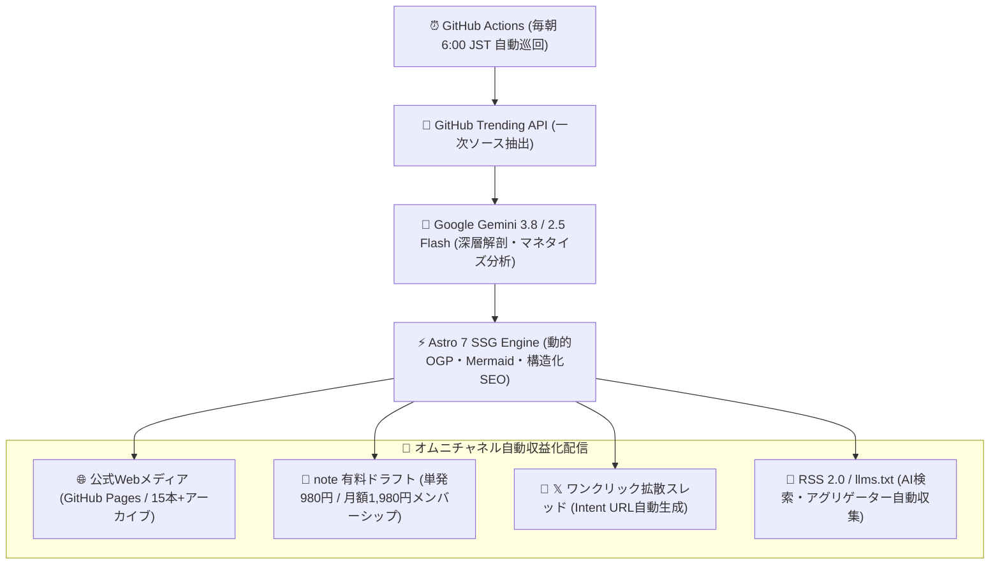

# 📡 Auto Tech Radar - Awesome Global Trending OSS Intelligence

> **Auto Tech Radar** は、世界中の GitHub Trending からスター急上昇中のオープンソース（OSS）を毎朝 6:00 (JST) に完全無人で自動検出。Google最先端AI（Gemini 3.8 / 2.5 Flash）が**「日本語アーキテクチャ深層解剖」**および**「受託開発・自社SaaS構築のマネタイズ実践法」**を自動生成・全世界配信する自律型テックインテリジェンスメディアです。

---

## ⚡ クイックアクセス・公式ゲートウェイ
- 🌐 **全世界公開メディア（公式自社HP）**: https://ssk0224.github.io/auto-tech-radar/
- 📊 **全OSS商用化チートシート（比較マトリクス）**: https://ssk0224.github.io/auto-tech-radar/cheatsheet/
- 📗 **note 公式メンバーシップ（全レポート読み放題）**: https://note.com/vast_ixora7005
- 💼 **企業研修・スキルアップ経費精算ガイド**: https://ssk0224.github.io/auto-tech-radar/expense/
- 💳 **Stripe 単発レポート即時購入（¥980）**: [Stripe即時決済](https://buy.stripe.com/aFaeVd8GV1CYgQG0NY00000)
- 𝕏 **公式速報アカウント**: [@AutoTechRadar](https://x.com/AutoTechRadar)

---

## 🏆 【完全保存版】注目の急上昇OSSアーキテクチャ解剖カタログ

| プロジェクト | カテゴリ / 言語 | GitHub Stars | アーキテクチャ概要 ＆ 商用活用 | 日本語解剖レポート |
| :--- | :--- | :--- | :--- | :--- |
| **[pinvou-agent](https://github.com/Pinvou/pinvou-agent)** | Rust / Tauri 2 / AI | ⭐ 2,400+ | 文書・デザイン・コードを1画面で納品物化する次世代デスクトップAI環境。ローカルvLLM対応 | [解剖レポートを読む →](https://ssk0224.github.io/auto-tech-radar/radar/pinvou-agent/) |
| **[answer-me-with-html](https://github.com/QingYunA/answer-me-with-html)** | JavaScript / LLM | ⭐ 2,350+ | LLMの出力を1枚の美しいHTML/図解に瞬時変換。出力トークン数を87%削減 | [解剖レポートを読む →](https://ssk0224.github.io/auto-tech-radar/radar/answer-me-with-html/) |
| **[tokenspeed](https://github.com/tokenspeed/tokenspeed)** | Python / C++ / LLM | ⭐ 2,200+ | 超高速LLM推論ベンチマーク＆プロファイリング基盤。推論サーバーコスト半減 | [解剖レポートを読む →](https://ssk0224.github.io/auto-tech-radar/radar/tokenspeed/) |
| **[OpenSandbox](https://github.com/opensandbox/opensandbox)** | Go / Security | ⭐ 15,700+ | AIエージェントやUntrustedコードを安全・ミリ秒単位で隔離実行する軽量サンドボックス | [解剖レポートを読む →](https://ssk0224.github.io/auto-tech-radar/radar/opensandbox/) |
| **[PotatoTool](https://github.com/potato-security/PotatoTool)** | Java / Security | ⭐ 1,200+ | 多機能セキュリティ総合解析ツール。暗号通信解読・AI悪意スクリプト検知を統合 | [解剖レポートを読む →](https://ssk0224.github.io/auto-tech-radar/radar/potatotool/) |
| **[GPTQModel](https://github.com/ModelCloud/GPTQModel)** | Python / PyTorch | ⭐ 1,270+ | 最新LLM量子化（圧縮）ツールキット。GPUメモリ削減と商用APIコスト劇的圧縮 | [解剖レポートを読む →](https://ssk0224.github.io/auto-tech-radar/radar/gptqmodel/) |
| **[JiuwenSwarm](https://github.com/jiuwenswarm/jiuwenswarm)** | Python / AI Agent | ⭐ 5,900+ | マルチエージェント協調オーケストレーション基盤。複雑ワークフローの完全自律化 | [解剖レポートを読む →](https://ssk0224.github.io/auto-tech-radar/radar/jiuwenswarm/) |

---

## 🏗 自律型オムニチャネル・アーキテクチャ

---

## 💼 B2B 協賛・受託開発・技術顧問のご相談
Auto Tech Radar では、テック企業様向けの以下のソリューションを提供しております：
- **OSS導入・自社開発支援**: レポート対象OSSの受託開発、社内AIワークスペース構築（50万〜250万円）
- **技術顧問・アーキテクチャ設計**: 最新LLM基盤・エージェント構築の技術コンサルティング
- **オフィシャルスポンサーシップ**: 当メディアおよび公式𝕏でのOSS活用プロダクト紹介・協賛掲載（10万円〜）

ご相談は **[公式 𝕏 (@AutoTechRadar) の DM](https://x.com/AutoTechRadar)** または **[GitHub Issues](https://github.com/ssk0224/auto-tech-radar/issues)** よりお気軽にお問い合わせください。

---

## 📜 ライセンス ＆ クレジット
- 本プロジェクトのソースコードおよびサイト構成は MIT License に基づき公開されています。
- 分析対象となる各オープンソースソフトウェアの権利は各リポジトリの著作者に帰属します。
- © 2026 Auto Tech Radar. Engineered with Google Gemini & Astro.
