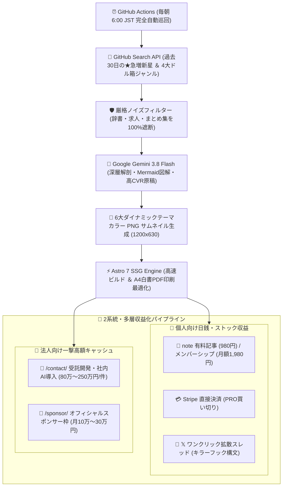

# 📡 Auto Tech Radar - Global Trending OSS Intelligence & Monetization Engine

> **Auto Tech Radar** は、世界中の GitHub Trending からスター急上昇中のオープンソース（OSS）を毎朝 6:00 (JST) に完全無人で自動検出。Google最先端AI（Gemini 3.8 / 2.5 Flash）が**「日本語アーキテクチャ深層解剖」**および**「受託開発（単価80万〜250万円）・自社SaaS構築のマネタイズ実践法」**を自動生成・全世界配信する自律型テックインテリジェンスメディアです。

---

## ⚡ クイックアクセス・公式ゲートウェイ
- 🌐 **全世界公開メディア（公式自社HP）**: https://ssk0224.github.io/auto-tech-radar/
- 📊 **全OSS商用化チートシート（Markdown/CSV出力・A4印刷対応）**: https://ssk0224.github.io/auto-tech-radar/cheatsheet/
- 📩 **法人・企業向け受託開発 ＆ AI導入相談窓口**: https://ssk0224.github.io/auto-tech-radar/contact/
- 📗 **note 公式メンバーシップ（全レポート読み放題）**: https://note.com/vast_ixora7005
- 💼 **企業研修・スキルアップ経費精算ガイド（稟議テンプレ付）**: https://ssk0224.github.io/auto-tech-radar/expense/
- 💳 **Stripe 単発レポート即時購入（¥980）**: [Stripe即時決済](https://buy.stripe.com/aFaeVd8GV1CYgQG0NY00000)
- 𝕏 **公式速報アカウント**: [@AutoTechRadar](https://x.com/AutoTechRadar)

---

## 🏆 【完全保存版】注目の急上昇OSSアーキテクチャ解剖カタログ

| プロジェクト | ドル箱カテゴリ / 言語 | GitHub Stars | 想定受託単価 | アーキテクチャ概要 ＆ 商用活用 | 日本語解剖レポート |
| :--- | :--- | :--- | :--- | :--- | :--- |
| **[pinvou-agent](https://github.com/Pinvou/pinvou-agent)** | 🤖 AI Agent / Rust | ⭐ 2,400+ | ¥150万〜¥350万 | 文書・デザイン・コードを1画面で納品物化する次世代デスクトップAI環境 | [解剖レポートを読む →](https://ssk0224.github.io/auto-tech-radar/radar/pinvou-agent/) |
| **[answer-me-with-html](https://github.com/QingYunA/answer-me-with-html)** | 🌐 Modern Web / LLM | ⭐ 2,350+ | ¥80万〜¥220万 | LLMの出力を1枚の美しいHTML/図解に瞬時変換。出力トークン数を87%削減 | [解剖レポートを読む →](https://ssk0224.github.io/auto-tech-radar/radar/answer-me-with-html/) |
| **[tokenspeed](https://github.com/tokenspeed/tokenspeed)** | ⚡ ローカル推論 / Python | ⭐ 2,200+ | ¥100万〜¥250万 | 超高速LLM推論ベンチマーク＆プロファイリング基盤。APIコスト半減 | [解剖レポートを読む →](https://ssk0224.github.io/auto-tech-radar/radar/tokenspeed/) |
| **[OpenSandbox](https://github.com/opensandbox/opensandbox)** | 🛠️ Security / Go | ⭐ 15,700+ | ¥100万〜¥250万 | AIエージェントやUntrustedコードを安全・ミリ秒単位で隔離実行する軽量サンドボックス | [解剖レポートを読む →](https://ssk0224.github.io/auto-tech-radar/radar/opensandbox/) |
| **[PotatoTool](https://github.com/potato-security/PotatoTool)** | 🛠️ Security / Java | ⭐ 1,200+ | ¥80万〜¥200万 | 多機能セキュリティ総合解析ツール。暗号通信解読・AI悪意スクリプト検知 | [解剖レポートを読む →](https://ssk0224.github.io/auto-tech-radar/radar/potatotool/) |
| **[GPTQModel](https://github.com/ModelCloud/GPTQModel)** | ⚡ 量子化 / PyTorch | ⭐ 1,270+ | ¥120万〜¥280万 | 最新LLM量子化（圧縮）ツールキット。GPUメモリ削減と商用APIコスト劇的圧縮 | [解剖レポートを読む →](https://ssk0224.github.io/auto-tech-radar/radar/gptqmodel/) |
| **[JiuwenSwarm](https://github.com/jiuwenswarm/jiuwenswarm)** | 🤖 AI Swarm / Python | ⭐ 5,900+ | ¥150万〜¥350万 | マルチエージェント協調オーケストレーション基盤。複雑業務の完全自動化 | [解剖レポートを読む →](https://ssk0224.github.io/auto-tech-radar/radar/jiuwenswarm/) |

---

## 🏗 自律型オムニチャネル ＆ 多層収益化アーキテクチャ

---

## 🛡️ ECC × SUPERPOWERS × SUBAGENT 品質保証体制
本プロジェクトは、3重のエージェント統制プロトコルにより運用されています：
1. **ECC (Enterprise & Confidentiality Guard)**: プライベートリポジトリや機密情報の完全隔離・外部漏洩ゼロトレランス。
2. **SUPERPOWERS (Defect Sweep & Quality Gate)**: Mermaid図解・PNGサムネイル・商用単価分析の全自動検証（`npm run audit`）。
3. **SUBAGENT (Swarm Market Intelligence)**: 海外テックトレンド・高成約率コピー・心理的トリガーの並行自律リサーチ。

---

## 💼 法人・企業様向け受託開発・AI導入支援
Auto Tech Radar では、テック企業様向けの以下のソリューションを提供しております：
- **自社専用AIエージェント構築**: レポート対象OSSの社内クラウド導入・業務ワークフロー連携（80万〜250万円）
- **商用SaaS脱課金リプレイス**: 月額課金SaaSのセルフホスト化によるランニングコスト完全ゼロ化
- **オフィシャルスポンサーシップ**: 当メディアおよび公式𝕏でのOSS活用プロダクト紹介・協賛掲載（月10万〜30万円）

👉 **[受託開発・導入支援の無料相談・見積もりフォームはこちら（/contact/）](https://ssk0224.github.io/auto-tech-radar/contact/)**

---

## 📜 ライセンス ＆ クレジット
- 本プロジェクトのソースコードおよびサイト構成は MIT License に基づき公開されています。
- 分析対象となる各オープンソースソフトウェアの権利は各リポジトリの著作者に帰属します。
- © 2026 Auto Tech Radar. Engineered with Google Gemini & Astro.
