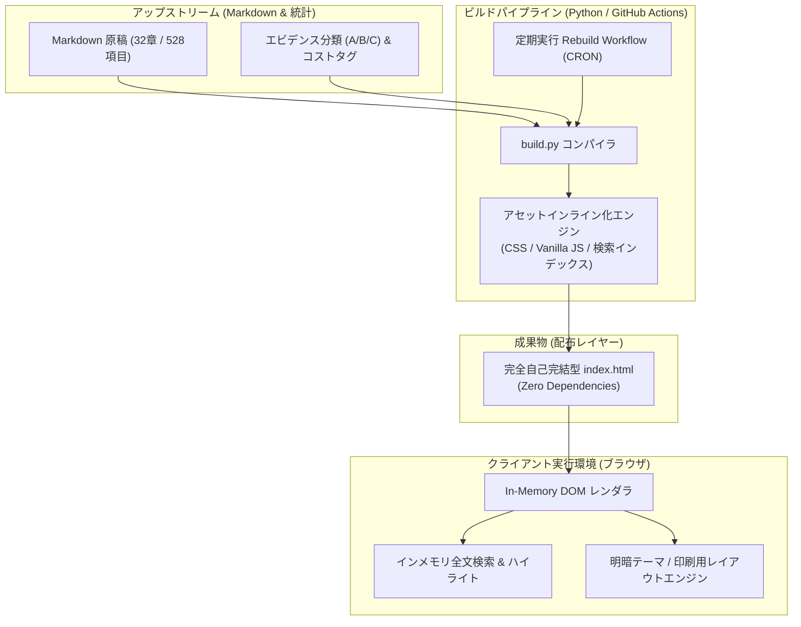

# how-to-live-better: 概要と革新性

GitHub上で1万スターを超える注目を集める「`cdyforever/how-to-live-better`」は、公有領域（Unlicense）のオープンソース書籍『高性价比人生指南（高コスパ人生ガイド）』全32章・528項目を、**単一のHTMLファイル（Single-File HTML）**として再構築した超軽量ナレッジリーダーです。

最大の特徴は、**「外部依存ゼロ（Zero External Dependencies）」**と**「完全オフライン動作（Offline-First）」**の設計思想にあります。CDN経由の外部フォント、CSSフレームワーク、クライアントサイドAPIフェッチを一切排除し、全文検索インデックス、レスポンシブUI、ダークモード切り替え、印刷用CSSに至るまですべてが1つの`index.html`に内包されています。

現代のWebフロントエンドが過剰な依存関係と重厚なSPAフレームワークに傾倒する中、静的ファイル1枚で高速かつ堅牢なナレッジ配信を実現するその構造は、エッジ環境や機密ネットワーク向けWeb開発に極めて強力な指針を与えています。

---

## 解決する主要な課題とアーキテクチャ

本プロジェクトは、現代のナレッジ共有システムが抱える「通信遮断時の閲覧不可」「重厚なビルドパイプラインによる高運用コスト」「外部トラッカーやCDN障害に伴う可用性低下」という課題を根本から解決しています。

### システム構成とビルド・レンダリングフロー

データソースとなるMarkdownリポジトリから単一HTMLをコンパイルし、ブラウザ上で完全閉域動作するまでのフローは以下の通りです。



### アーキテクチャの要点
1. **Zero External Requests**: ブラウザ起動後、追加のHTTPリクエストを1回も発生させません。
2. **インメモリ全文検索**: JavaScriptにより全528件のタイトル・本文・コスト・統計タグをリアルタイム探索し、該当キーワードを動的ハイライトします。
3. **ステートレスな同期設計**: Upstreamリポジトリの更新をGitHub Actionsで常時監視し、差分発生時のみ決定論的（Deterministic）に単一HTMLを再ビルドします。

---

## 競合ツール/商用SaaSとの徹底比較

| 評価軸 | cdyforever/how-to-live-better (本OSS) | 一般的なヘッドレスCMS / Docs (Notion, Docusaurus) | 商用ナレッジSaaS (esa, Qiita Team等) |
| :--- | :--- | :--- | :--- |
| **外部通信要件** | **不要（完全オフライン・閉域網動作）** | 必須（初期ロードおよびアセットフェッチ） | 必須（クラウド常時接続） |
| **単一配布性** | **極めて高い（index.html 1枚のみ）** | 低（静的アセットディレクトリ群が必要） | 不可（アカウント・テナント依存） |
| **インフラ運用コスト** | **0円（GitHub Pages / S3等に置くだけ）** | 月額数百円〜数千円（ホスティング基盤） | 月額1ユーザー数百円〜数千円 |
| **検索レイテンシ** | **1ms未満（クライアント内完全即時）** | 50〜300ms（AlgoliaやAPI通信） | 100〜500ms（サーバーサイド検索） |
| **セキュリティ・耐障害性** | **サプライチェーン攻撃の余地ゼロ** | 外部CDN障害やnpm依存の脆弱性リスク | SaaS側ダウンタイム・情報漏洩リスク |

---

## 💡 ビジネス・マネタイズ活用アイデア（実践例）

### 1. 医療現場・船舶・航空機向け「完全閉域オフラインマニュアル」受託（想定単価: 120万〜200万円）
ネットワーク接続が制限される、あるいは災害時に通信インフラが途絶する現場（医療従事者向け緊急対応マニュアル、工場ラインのトラブルシューティング、船舶マニュアル）向けに、本OSSのビルドエンジンをベースとした**「1クリック生成型オフラインWebリーダー」**を構築・納品します。端末にファイルを配布するだけで動作するため、MDM（モバイルデバイス管理）による一括配布とも抜群の親和性があります。

### 2. 規制業界向け「社内コンプライアンス・エビデンス辞書」基盤
原著が「A/B/Cランクのエビデンス」「投資対効果」を明確にタグ付けしている設計を模倣し、社内の法務ガイドライン、セキュアコーディング規約、社内手続き集をデータベース化。Pythonビルド時にPDF化・単一HTML化を同時生成する社内DXソリューションとして横展開可能です。

---

## インストール & クイックスタート手順

### 1. 閲覧するだけの場合
ビルド環境は不要です。ブラウザでファイルを直接開くだけで即座に動作します。
```bash
# クローンしてローカルで開く
git clone https://github.com/cdyforever/how-to-live-better.git
cd how-to-live-better
open index.html # またはダブルクリック
```

### 2. 原本リポジトリから再ビルドする場合
Python 3系のみで動作し、追加パッケージのインストールは不要です。

```bash
# 1. 上流（Upstream）のMarkdownリポジトリを取得
git clone --depth 1 https://github.com/eternity4719/HowToLiveBetter.git /tmp/upstream

# 2. 本プロジェクトをクローン
git clone https://github.com/cdyforever/how-to-live-better.git
cd how-to-live-better

# 3. 全32章を単一HTMLとしてコンパイル
python build.py all -o index.html --repo /tmp/upstream

# ※ 特定の章（例: 1章, 2章, 16章）のみをビルドする場合
python build.py 1 2 16 -o custom.html --repo /tmp/upstream
```

---

## 商用利用可否 & ライセンス考察

- **原著コンテンツ（eternity4719/HowToLiveBetter）**: **Unlicense**（パブリックドメイン）。著作権が放棄されており、営利・非営利を問わず改変、再配布、商用利用が完全に自由です。
- **本リポジトリのビルドコード（cdyforever/how-to-live-better）**: READMEに「本仓库的构建脚本同样不作任何权利保留（本倉庫のビルドスクリプトも同様に一切の権利を留保しない）」と明記されており、同じくパブリックドメイン準拠です。

**結論**: 企業内システムの受託開発や、コードをベースにした商用SaaS・独自ツールの構築・販売に関して、ライセンス表示義務すら課されない極めて自由度の高い設計となっています。受託開発のテンプレート資産として安全に組み込み可能です。