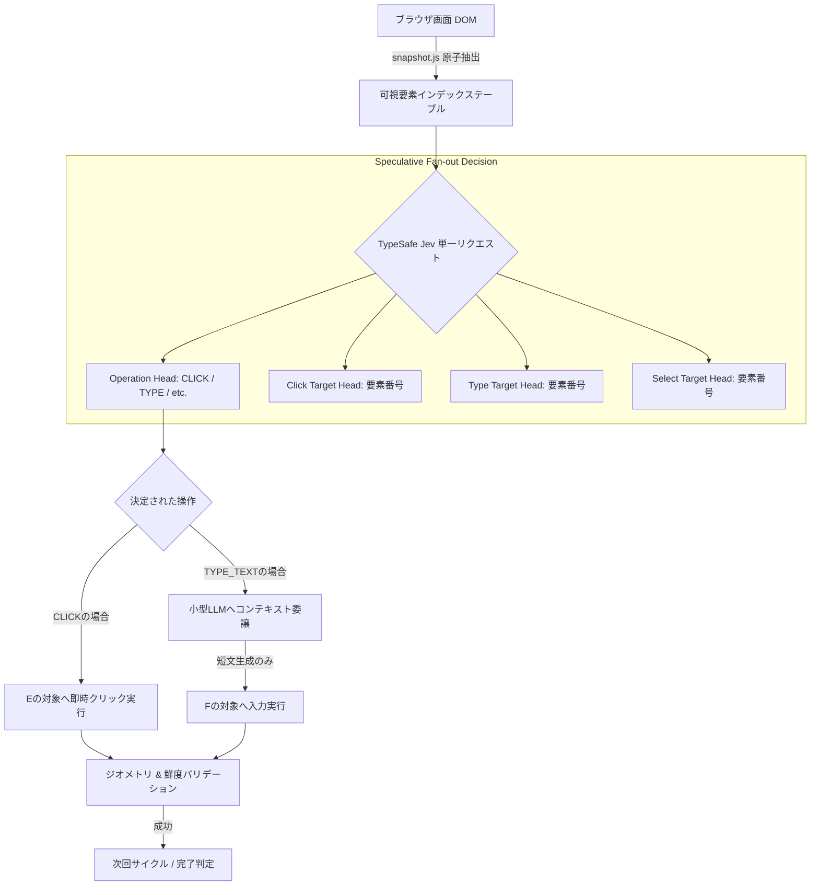

# jev-ultrafast: 概要と革新性

**jev-ultrafast**は、Webブラウザ自動化における最大のボトルネックであった「推論レイテンシ」と「トークンコスト」を劇的に打破するために開発された、超高速・超低コストの自律型ブラウザエージェントフレームワークです。

従来のマルチモーダルWebエージェント（GPT-4VやClaude 3.5 Sonnetなどを用いた画面キャプチャベースの方式）は、1ステップごとに高解像度スクリーンショットをモデルへ送信し、巨大なコンテキストを消費しながら数秒〜十数秒かけて次の操作（座標クリックや入力）を推論していました。このアプローチは精度こそ高いものの、API課金額の爆発と極度の遅延が商用本番導入の致命的な壁となっていました。

jev-ultrafastはこのパラダイムを根本から刷新します。TypeSafeの「Jev」アーキテクチャを採用し、**「1回のネットワーク往復で操作タイプと対象要素を同時に投機的推論」「スクリーンショットを排除した極小DOMスナップショット」「テキスト入力時のみ小型LLMに委譲」**という3段階のハイブリッドパイプラインを構築。Google Flightsでの複雑なフライト検索タスクをわずか**7.1秒**で完結させ、従来のBrowser Use構成と比較してCDP（Chrome DevTools Protocol）コール数を**1,092回から101回へと90%以上削減**、実行速度を25%高速化することに成功しました。

---

## 解決する主要な課題とアーキテクチャ

### 1. 従来型ブラウザエージェントの課題
- **高額なVLMコスト**: スクリーンショット1枚あたり数千トークンを消費し、1タスク数十ステップで数百円のコストが発生。
- **直列的レイテンシ**: 「画面解析 → アクション決定 → ターゲット要素特定 → 入力文字列生成」が直列に行われ、1アクションに3〜5秒を要する。
- **DOM肥大化によるコンテキスト溢れ**: 巨大なHTMLツリーをそのまま投じることによるトークン圧迫とハルシネーション。

### 2. jev-ultrafastのコアアーキテクチャ

jev-ultrafastは、観察（Observation）ごとに可視領域のインタラクティブ要素のみを抽出した「番号付きエレメントテーブル」を原子的に構築し、1リクエスト内で操作（Operation）と各操作ごとのターゲット候補（Target Heads）を投機的に同時取得します。



### 3. 超高速化を支える主要技術
1. **投機的ファンアウト（Speculative Fan-out）**: 
   「次がCLICKならどの要素か」「TYPE_TEXTならどの要素か」を1回の推論パスで並列予測。確定したOperationに応じたTargetを即座に採用するため、ネットワークRTTを半減。
2. **Atomic DOM Snapshot**: 
   JavaScriptフックを用いて、ビューポート内の操作可能ノード（ボタン、入力欄、コンボボックス）のみをインデックス化し、ノード参照を保持したままテーブル化。
3. **小型LLMによるテキスト補完の分離**: 
   ナビゲーションやクリックの決定には汎用大型モデルを使わず、フォーム入力に必要な文脈生成時のみ超軽量LLM（Mercury-2.5、GLM、DeepSeek等）を呼び出すことで、ミリ秒単位の応答と最小コストを両立。

---

## 競合ツール/商用SaaSとの徹底比較

| 評価項目 | jev-ultrafast (OSS) | 従来型 Browser-Use / LangChain | 商用SaaS (MultiOn / Browserbase) |
|---|---|---|---|
| **レイテンシ (平均)** | **1〜2秒 / ステップ**（全体7秒台完結） | 4〜8秒 / ステップ | 3〜6秒 / ステップ |
| **APIコスト / タスク** | **極小（約0.05〜0.3円）** | 高（約5〜30円） | 従量課金＋基本料金（高額） |
| **入力モーダリティ** | 構造化DOMテキスト + 必要時小型LLM | Vision (スクリーンショット) | Vision + DOMハイブリッド |
| **実行環境** | ローカルChrome / セルフホスト | ローカル / クラウド | 完全クラウド閉塞（Vendor Lock-in） |
| **確実性 / 衝突検証** | 実行直前に座標・遮蔽・DOM鮮度を自動検証 | 座標推定のズレによる空振りリスク有 | プロプライエタリ（内部ブラックボックス） |
| **ライセンス** | **MIT License（完全商用フリー）** | MIT / Apache 2.0 | プロプライエタリ（ソース非公開） |

---

## 💡 ビジネス・マネタイズ活用アイデア（実践例）

### 1. 「超高速・低コスト」航空券・ホテル価格追跡マイクロSaaS
従来、スクレイピング対策が厳しい動的旅行サイト（Google Flights、Skyscanner等）のデータ収集には高額なプロキシと重厚なヘッドレスブラウザ保守が必要でした。jev-ultrafastを活用すれば、数秒で検索結果画面まで到達して構造化データを取得するワーカーを極小リソースで運用可能。月額数千円〜数万円のニッチ旅行・出張手配最適化SaaSを構築できます。

### 2. レガシー社内システム（ERP/経費精算）のRPAリプレイス受託
APIが存在せず、UI変更に弱い従来型RPA（UiPathやWinActor）で自動化されていた社内業務を、自然言語指示で動く自律ブラウザエージェントへ置き換えるDX受託開発。1案件あたり150万〜300万円規模で受注し、維持管理コストを劇的に下げる提案が可能です。

### 3. Eコマース競合価格自動調査＆自動発注エージェント
EC事業者向けに、特定商品の仕入れ元サイトや競合モールを巡回し、在庫復活の検知からカート投入、購入フローの手前までを全自動化する自社プロダクトの展開。

---

## インストール & クイックスタート手順

### 前提要件
- Python 3.11 以上
- [uv](https://github.com/astral-sh/uv)（高速Pythonパッケージマネージャー）
- Google Chrome

### 1. リポジトリのクローンと環境構築
```bash
git clone https://github.com/browser-use/jev-ultrafast.git
cd jev-ultrafast

# 依存関係の同期（browser-harness等を含む）
uv sync

# 環境変数ファイルの作成
cp .env.example .env
```

`.env`ファイルに以下のキーを設定します：
```ini
TYPESAFE_API_KEY=your_typesafe_api_key
TEXT_MODEL_API_KEY=your_openrouter_or_openai_key
TEXT_MODEL_ENDPOINT=https://openrouter.ai/api/v1
TEXT_MODEL_NAME=inception/mercury-2.5
```

### 2. ローカルインスペクター（GUIデモ）の起動
```bash
uv run jev
```
ブラウザで `http://127.0.0.1:8766` にアクセスし、「Start demo → Run automatically」をクリックすることで、リアルタイムな推論確率と要素インデックスの挙動を確認できます。

### 3. Pythonコードからの組み込み利用
```python
from jev_ultrafast import Agent

goal = (
    "Find one-way flights from Zurich to London on September 20, 2026, "
    "for one adult in economy. Stop when matching flight options are visible."
)

with Agent("https://www.google.com/travel/flights?hl=en", goal) as agent:
    for state in agent.run():
        print(f"Elapsed: {state['elapsed_ms']}ms | Status: {state['status']}")
```

---

## 商用利用可否 & ライセンス考察

jev-ultrafastは**MIT License**のもとで公開されています。
商用利用、コード改変、再配布、プライベートリポジトリへの組み込み、自社SaaSバックエンドへの採用が無償かつ制限なしで認められています。著作権表示とライセンス全文の保持のみが要件です。

エンタープライズ商用展開における留意点は以下の2点です：
1. **APIキーの依存関係**: デフォルトではTypeSafeの投機的推論エンドポイントとOpenRouter（またはOpenAI互換API）を呼び出します。完全オンプレミス環境で運用する場合は、モデルインターフェース（`model.py`）を社内ホストのvLLM/Ollama等のエンドポイントに差し替える設計が必要です。
2. **DOM取得の制約**: 現状のMVPではShadow DOMの深層展開、Canvas内部描画、複雑なiframe、ファイルアップロードが対象外となっています。社内システムでこれらを利用している場合は、`snapshot.js`に拡張スクリプトを追加定義して対応する必要があります。