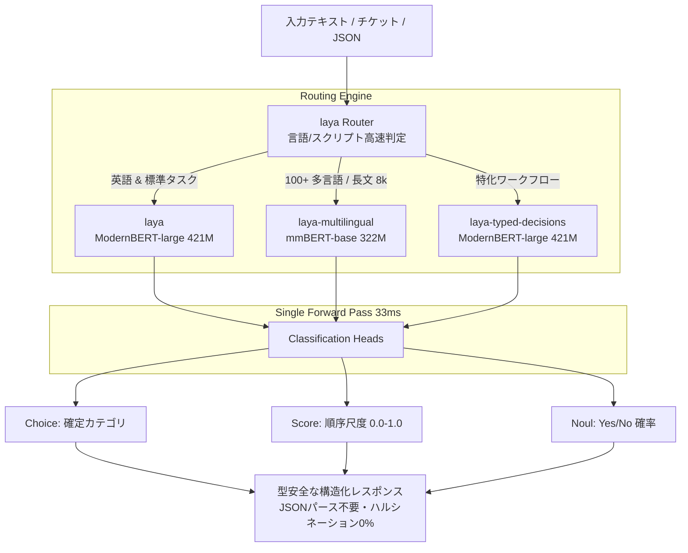

# laya: 概要と革新性

LLM（大規模言語モデル）の台頭により、カスタマーサポートのトリアージ、コンテンツモデレーション、ルーティングなどのテキスト分類タスクにGPT-4やClaude等の生成モデルを組み込む例が急増しました。しかし、そこでエンジニアが直面するのが**「トークン生成による大きなレイテンシ（数百ms〜数秒）」「高額なAPIコスト」「JSONパース失敗」「確率的ハルシネーション」**というSystem 2（熟慮型）推論特有の致命的ペインです。

GitHubで31,000スターを超える急上昇OSS **「laya」** は、この課題を根本から覆す**「Non-autoregressive（非自己回帰型）System 1意思決定エンジン」**です。

Daniel Kahnemanの提唱する「System 1（直感的・瞬時な思考）」をAIアーキテクチャに落とし込み、テキスト生成（Token-by-token generation）を一切行いません。独自のエンコーダ構造（ModernBERT / mmBERT）と、厳密適格スコアリングルール（Strictly Proper Scoring Rules: RLCD）で学習された分類ヘッドにより、**単一のフォワードパス（わずか33ms）**で型付けされた決定（Typed Choice、Score、Yes/No）を出力します。

### 革新的なポイント
- **超低レイテンシ・高スループット**: 単一クエリ33ms、バッチ処理時7.2ms/クエリ（T4 GPU測定）。生成AI比較で10〜30倍の高速化。
- **ゼロ・ハルシネーション & 堅牢な型安全性**: テキストを生成しないため、存在しないラベルの出力やJSONの構文エラーが構造的にゼロ。
- **100以上の言語を自動ルーティング**: サブミリ秒で言語とスクリプトを判定し、最適なチェックポイントへ振り分ける内蔵`Router`。
- **長文対応（最大8,192トークン）**: `laya-multilingual`は最大8,192トークンまでの長文コンテキストに対応。

---

## 解決する主要な課題とアーキテクチャ

従来のLLMベースの意思決定パイプラインでは、プロンプトにJSONスキーマを埋め込み、生成された文字列をPydantic等でバリデーションしていました。この方式はトークン課金が嵩むだけでなく、並列リクエスト時のキュー詰まりを引き起こします。

`laya`は、リクエスト判定を瞬時に行う「Router層」と、特化型エンコーダで構成された「Decision Engine層」の2層構造を採用しています。



### モデルチェックポイントの役割分担
1. **`laya` (421M / ModernBERT-large)**: 英語テキストに最適化されたベースモデル。コンテキスト512トークン。
2. **`laya-multilingual` (322M / mmBERT-base)**: 100以上の言語に対応し、ベースモデルの約2倍の推論速度を誇る。最大8,192トークンまで拡張可能。
3. **`laya-typed-decisions` (421M)**: 業務意思決定ベンチマークでRLCDによりファインチューニングされた高精度モデル。

---

## 競合ツール/商用SaaSとの徹底比較

| 比較項目 | OpenAI GPT-4o-mini | 一般的なBERT/RoBERTa分類 | **laya** |
|---|---|---|---|
| **推論方式** | 自己回帰型（テキスト生成） | 単一分類ヘッド | **非自己回帰型 System 1意思決定** |
| **平均レイテンシ** | 400ms 〜 1,500ms | 20ms 〜 50ms | **33ms（バッチ時7.2ms）** |
| **API/インフラコスト** | トークン従量課金（高額） | 自社サーバー（低〜中） | **自社サーバー / T4やCPUで極小運用** |
| **JSONパース失敗率** | 稀に発生（リトライ必須） | 発生しない（固定ID出力） | **ゼロ（型定義済みChoice/Score）** |
| **多言語ルーティング** | プロンプトで暗黙処理 | 言語ごとにモデル切り替え要 | **ビルトインRouterで100言語自動切替** |
| **長文サポート** | 128kトークン | 通常512トークン固定 | **最大8,192トークン対応** |
| **適応性（ゼロショット）** | 高い | ゼロショット不可（要学習） | **質問と基準を動的に指定可能** |

---

## 💡 ビジネス・マネタイズ活用アイデア（実践例）

### 1. 超低遅延カスタマーサポート・トリアージ基盤の受託開発（単価80万〜180万円）
- **ターゲット**: 月間数万件以上の問い合わせを抱えるEC・SaaS事業者。
- **課題**: 現在OpenAI APIで自動分類しているが、月額API費用が30万円を超え、さらに返答遅延でオペレーター画面のロードが遅い。
- **解決策**: `laya`を用いたオンプレミス/プライベートクラウド推論サーバー（FastAPI + Docker）を構築。社内チケットを33msで「部署振り分け」「緊急度（1-3）」「解約リスク（Yes/No）」に同時判定。
- **ビジネス価値**: クラウドAPIコストを90%削減し、トリアージ画面のレスポンスを爆速化。

### 2. 高スループット・コンテンツモデレーションSaaSの構築（月額サブスクリプション）
- **プロダクト案**: CGMサービスやコミュニティアプリ向けの「リアルタイム投稿検閲API」。
- **強み**: 投稿ボタンが押された瞬間に、誹謗中傷・スパム・規約違反をミリ秒単位で同時判定。100言語対応のためグローバル展開アプリにも即対応可能。

### 3. Agentic AI（自律型エージェント）の超高速ルーター基盤
- **実装例**: LangChainやCrewAIのAgent間で、次にどのツール・エージェントを呼ぶべきかの分岐条件を`laya`で処理。重たいLLMを前段のルーティングから排除し、パイプライン全体の実行時間を1/5に圧縮。

---

## インストール & クイックスタート手順

### インストール

```bash
# pipでインストール
python -m pip install laya

# uvを使用する場合
uv add laya

# HTTPサーバーやエコシステム連携を含める場合
pip install "laya[serve,langchain]"
```

### Pythonでの基本実装

```python
from laya import Router

# 初回実行時に必要なチェックポイントを自動ダウンロード
router = Router()

state = "3月分の請求が二重に引き落とされています。本日中に返金してください。対応されない場合は解約します。"

# 複数の質問（Choice, Score, Yes/No）を定義
questions = {
    "department": {
        "type": "choice",
        "instructions": "どの部門が対応すべきですか？",
        "criteria": {
            "billing": "請求、支払い、返金手続き",
            "technical": "システム障害、バグ、エラー",
            "other": "その他一般的な問い合わせ"
        }
    },
    "urgency": {
        "type": "score",
        "instructions": "緊急度はどれくらいですか？",
        "criteria": ["急ぎではない", "本日中〜数日以内", "ブロッキング/緊急"]
    },
    "churn_risk": {
        "type": "noul",
        "instructions": "ユーザーはサービスの解約や離脱を警告していますか？"
    }
}

# 1回のフォワードパスで全判定を実行
result = router.predict(state, questions)

print("担当部門:", result["answers"]["department"]["choice"])  # billing
print("解約リスク確率:", result["answers"]["churn_risk"]["noul"])  # 0.95+
print("使用モデル:", result["routing"]["model"])                 # multilingual
```

---

## 商用利用可否 & ライセンス考察

`laya`は **Apache License 2.0** で公開されています。

- **商用利用**: 完全に許可されており、商用SaaSのバックエンドや受託案件の納品コードに組み込むことが可能です。
- **改変・再配布**: ソースコードの改変や自社バイナリへの同梱配布も認められています。著作権表示とライセンス通知の保持が必要です。
- **特許の取り扱い**: Apache 2.0には特許ライセンスの相互許諾条項が含まれており、エンタープライズ企業でも安心して法務チェックをパスできる設計となっています。

自社独自の決定ロジックをRLCDでファインチューニングした場合も、その重み（チェックポイント）の所有権は自社に帰属させることが可能です。