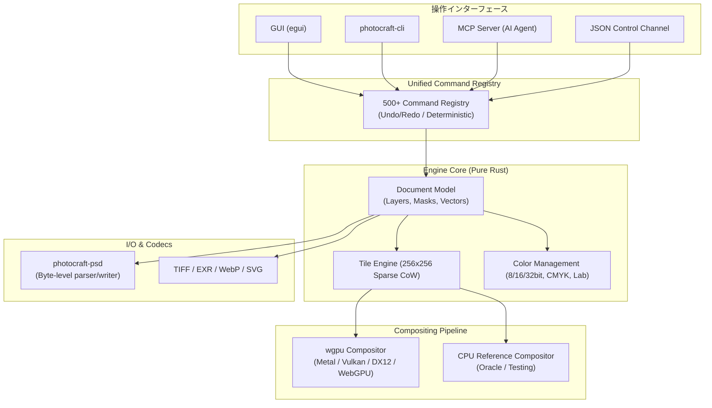

# photocraft: 概要と革新性

**PhotoCraft**（フォトクラフト）は、Adobe Photoshopをクリーンルーム設計（仕様の分析と振る舞い観察のみに基づき、プロプライエタリなコードを一切参照しない完全新規実装）により、**100% Pure Rust**で再構築したオープンソースの本格的画像編集アプリケーションです。

単なる「Photoshop風のUIを持つペイントソフト」にとどまらず、PSDファイルの高精度な可逆性（psd-toolsテストセット309件中307件で描画完全一致）、非破壊調整レイヤー、レイヤースタイル、高度なベクターパス、スマートオブジェクト、カラーマネジメント（ICC、CMYK/Lab、32bit HDR対応）を完全再現しています。さらに最大の革新点として、**「AIエージェント対応（MCP / CLI / JSON制御）」**を中核に設計されており、人間がGUIから操作するツールとしてだけでなく、LLMや自動化パイプラインが完全自律制御できるグラフィックエンジンとして機能します。

---

## 解決する主要な課題とアーキテクチャ

### 1. 解決する技術課題
- **ベンダーロックインと月額コストの高騰**: 商用SaaSやAdobe CCの高額ライセンス、クラウド強制同期、データ主権の問題を完全ローカル・オフライン動作で解決。
- **リソース過剰消費と非効率なUIスタック**: 近年のデスクトップアプリに多いElectron/Chromiumベースではなく、Pure Rustとegui、GPUネイティブコンポジタを採用し、省メモリ・超高速起動を実現。
- **自動化とヘッドレス運用の障壁**: 従来のDTP/グラフィックツールはGUI主導であり、サーバーサイドでのバッチ処理やAI連携が困難だったが、全機能をコマンド駆動化。

### 2. コアアーキテクチャ設計
PhotoCraftは24のクレートから構成される強固なレイヤードアーキテクチャを持ち、UI層とドキュメントエンジン層が完全に分離されています。



- **統一コマンドレジストリ**: 500以上の全操作がコマンドとして抽象化され、GUIクリックもMCP経由のプロンプト指示も全く同じ内部関数を叩きます。
- **Copy-on-Write (CoW) タイルエンジン**: キャンバスを256×256ピクセルのスパースタイルで管理。大解像度キャンバスでも変更部分のみを複製するため、ヒストリー（Undo）がメモリを圧迫しません。
- **デュアルコンポジタ**: CPUリファレンスコンポジタ（テスト用正解オラクル）と、`wgpu`を用いたマルチバックエンド（Vulkan, Metal, DirectX 12, WebGPU）GPUコンポジタを備え、画質の完全性とミリ秒単位の描画を両立。

---

## 競合ツール/商用SaaSとの徹底比較

| 評価軸 | PhotoCraft | Adobe Photoshop | GIMP | Photopea |
|---|---|---|---|---|
| **コア言語** | Pure Rust | C++ / Proprietary | C | JavaScript (ブラウザ) |
| **ランタイム** | ネイティブ / Wasm | ネイティブ | ネイティブ (GTK) | ブラウザ / WebAssembly |
| **ライセンス** | MIT / Apache-2.0 | 商用プロプライエタリ | GPLv3 | 商用（広告/サブスク） |
| **PSD互換性** | 極めて高い (99.3%) | 公式標準 | 部分的（エフェクト欠落有） | 高い |
| **ヘッドレス・CLI** | ネイティブ対応 (CLI/MCP) | ExtendScript (制約大) | Script-Fu / Python | 不可（ブラウザ依存） |
| **AIエージェント統合** | MCPサーバー内蔵 | Firefly (クラウドのみ) | なし | なし |
| **動作環境** | Win / Mac / Linux / Web | Win / Mac / iPad | Win / Mac / Linux | ブラウザ |

---

## 💡 ビジネス・マネタイズ活用アイデア（実践例）

1. **AI画像生成パイプラインのポストプロセッシング自動化SaaS**
   - ComfyUIやMidjourney等で生成されたラフ画像に対し、PhotoCraftのヘッドレスCLIを用いて自動でトーンカーブ補正、スマートシャープ、レイヤー合成、特定フォーマット（CMYK 300dpi印刷用PSD）へ変換して納品するB2Bワークフロー。
2. **社内クリエイティブ基盤のオンプレミス移行受託（DX支援）**
   - 外部クラウドへのデザインデータ流出が禁止されている製造業・金融・エンタメ系企業向けに、完全オフライン動作のPhotoCraft環境をシンクライアント／社内サーバーへデプロイし、Photoshop年間ライセンス費用（数百〜数千万円規模）を削減するコンサルティング。
3. **MCP連携による自律型デザインアシスタントの構築**
   - Claude DesktopやローカルLLMから`photocraft-cli mcp`を呼び出し、自然言語で「バナーのモデル部分にドロップシャドウをかけ、背景の彩度を落としてCTAボタンテキストを配置して」と指示するだけでレイヤー編集を実行する自社製デザインエージェント基盤。

---

## インストール & クイックスタート手順

### 1. ソースコードからのビルドと実行（推奨環境: Rust 1.80+）

```bash
# リポジトリのクローン
git clone https://github.com/storytold/photocraft.git
cd photocraft

# デスクトップアプリの起動（リリースビルド）
cargo run --release -p photocraft -- sample.psd

# テストスイートの実行
cargo test --workspace
```

### 2. CLIツールを用いたヘッドレス画像処理

```bash
# ヘッドレスでPSDを開き、スマートシャープとトーンカーブを適用してPNG出力
photocraft-cli run input.psd \
  --cmd filter.sharpen.smartSharpen --params '{"amount":80}' \
  --cmd layer.newAdjustmentLayer.curves --params '{"points":[[0,0],[64,48],[192,212],[255,255]]}' \
  --out output.png

# フォルダ内画像への一括バッチ処理
photocraft-cli batch --actions grade.json --in ./raw --out ./graded
```

### 3. Model Context Protocol (MCP) サーバーの起動

```bash
# AIエージェントと通信するためのMCPサーバーを起動
photocraft-cli mcp
```

---

## 商用利用可否 & ライセンス考察

PhotoCraftは **MIT License** または **Apache License 2.0** のデュアルライセンスで提供されています。

- **商用利用**: 完全フリーで商用利用・商用製品への組み込み、SaaSバックエンドとしての利用が可能です。
- **クリーンルーム実装**: Adobeの特許・ソースコードを直接複製しておらず、公開仕様（Adobe PSD Specification）および挙動テストに基づきクリーンルームで作成されているため、著作権侵害リスクが最小化されています。
- **注意点**: リポジトリに含まれるロゴ・商標（ArtCraft / PhotoCraft）はブランドライセンスで保護されているため、フォークして再配布・再販売する際は自社ブランドへの差し替えが必要です。