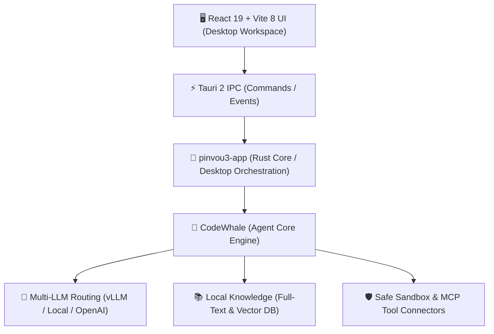

# pinvou-agent: 概要と革新性

**pinvou-agent**は、「対話して終わり」のチャットボットから脱却し、実務における**具体的成果物（Deliverables）の生成・編集・反復作業**を完結させるために設計されたオープンソースのデスクトップAIエージェント環境です。

デスクトップランタイムには最新の**Tauri 2**と**Rust**を採用し、フロントエンドに**React 19 / Vite 8**を組み合わせています。軽量・高速かつ強固なセキュリティ境界を維持しつつ、MCP（Model Context Protocol）、ローカルナレッジ（RAG）、ACP（Agent Communication Protocol）を統合した「3-in-1（Work / Design / Code）」ワークスペースを提供します。

### 革新的なコアバリュー
1. **チャットから成果物（Artifact）中心のアプローチへ**: 生成されたMarkdown、ポスター、図解、コードを専用の「Artifact Panel」で即座にプレビュー・直接編集可能。
2. **ACP（Agent Communication Protocol）によるマルチエージェント協調**: Codex、Claude Code、Kimiなどの独立コーディングエージェントをローカルプロジェクトに安全に接続・常駐。
3. **ローカルファーストなプライバシー設計**: vLLM等のローカル推論基盤と組み合わせることで、完全エアギャップ（オフライン）環境でのエンタープライズ実行が可能。

---

## 解決する主要な課題とアーキテクチャ

### 既存AIツールの課題
- **コンテキストの断片化**: ドキュメント作成、デザイン、コーディングでツールが分断され、コピペの往復が発生する。
- **実行権限と安全性のジレンマ**: 自律エージェントにシェル権限を渡す際、不透明な実行によるシステム破壊リスクが存在する。
- **データプライバシーの懸念**: 機密コードや社内ナレッジを外部SaaSへアップロードすることへのコンプライアンス制限。

### アーキテクチャ構成

- **UI層とエンジン層の完全分離**: デスクトップ制御を担う`pinvou3-app`と、モデル推論・ツール呼び出し・コンテキスト圧縮を司る`CodeWhale`エンジンが疎結合に設計されており、拡張性と保守性に優れています。
- **MCP & コネクタエコシステム**: Lark（飛書）、DingTalk、Obsidianなどの企業内ツールや、ローカル/リモートのMCPサーバーを統一管理ストアから導入可能です。

---

## 競合ツール/商用SaaSとの徹底比較

| 評価軸 | pinvou-agent | Cursor / Claude Code | 汎用AIチャット (ChatGPT等) |
| :--- | :--- | :--- | :--- |
| **主要領域** | Work / Design / Code（統合型） | ソフトウェアエンジニアリング特化 | テキスト対話（汎用） |
| **成果物管理** | Artifactパネル + 直接WYSIWYG編集 | ファイルツリー直接編集 | コードブロック・プレビューのみ |
| **推論基盤** | ローカルvLLM / 任意OpenAI互換 | 専用クラウド（一部ローカル設定可） | ベンダー固定クラウド |
| **拡張規格** | MCP / CLI / Skills / Workflows | 専用プラグイン / CLI | API / GPTs |
| **ランタイム負荷** | 極小（Rust + Tauri 2） | 中〜重（Electronベース） | ブラウザ依存 |
| **価格・ライセンス** | 無料・オープンソース（MIT） | 有料サブスクリプション | 有料サブスクリプション |

---

## 💡 ビジネス・マネタイズ活用アイデア（実践例）

### 1. セキュア企業向け「オフラインAIワークスペース」導入支援
- **概要**: 金融、医療、防衛などの機密データを扱う企業に対し、オンプレミスGPUサーバー（vLLM）とpinvou-agentを組み合わせたゼロデータリーク環境を構築。
- **マネタイズ**: 環境構築費（初期80万〜200万円）＋ 社内MCPコネクタ開発（1コネクタあたり30万〜50万円）＋ 保守保守運用費。

### 2. 業界特化型「Skillパック」の作成と販売
- **概要**: 法務レビュー、特許調査、SEO記事・図解自動作成など、pinvou-agent上で動く専用プロンプト・ワークフロー・`SKILL.md`定義をモジュール化して販売。
- **マネタイズ**: 月額サブスクリプション型のナレッジベース配信、または買い切りパッケージ販売。

### 3. 社内業務オペレーション自動化コンサルティング
- **概要**: 既存のObsidianや社内チャットツール（Slack/Teams/Lark）と連携するカスタムMCPサーバーを開発し、中間管理業務・レポート生成を完全自動化する受託開発。

---

## インストール & クイックスタート手順

### 必要環境
- Git（サブモジュール対応）
- Node.js & npm
- Rust toolchain（stable）
- 各OS向けTauri 2システム依存パッケージ
- vLLM または OpenAI互換エンドポイント

### ソースコードからの起動

```bash
# 1. リポジトリを再帰的にクローン
git clone --recursive https://github.com/Pinvou/pinvou-agent.git
cd pinvou-agent/pinvou3-app

# 2. 依存パッケージのインストール
npm ci

# 3. 開発環境の起動
cd ..
./pinvou3-app/run-dev.sh
```

### ローカルvLLMエンドポイントの設定例
起動後、設定UIまたは環境変数にてローカル推論基盤を指定します。

```bash
export DEEPSEEK_BASE_URL="http://127.0.0.1:8000/v1"
export DEEPSEEK_API_KEY="local-no-auth"
export DEEPSEEK_MODEL="deepseek-ai/DeepSeek-V3"
```

---

## 商用利用可否 & ライセンス考察

- **ライセンス**: **MIT License**
- **商用利用**: 完全フリーで商用利用・改変・再配布が可能。
- **アーキテクチャ上の注意点**:
  - コアエンジンである`CodeWhale`サブモジュールを含め、フォークポリシー（`docs/fork-policy.md`）に従う必要があります。
  - プロプライエタリな自社製品としてリブランディングして配備する場合は、サードパーティライセンス通知（`THIRD_PARTY_NOTICES.md`）を同梱し、MIT著作権表示を保持してください。