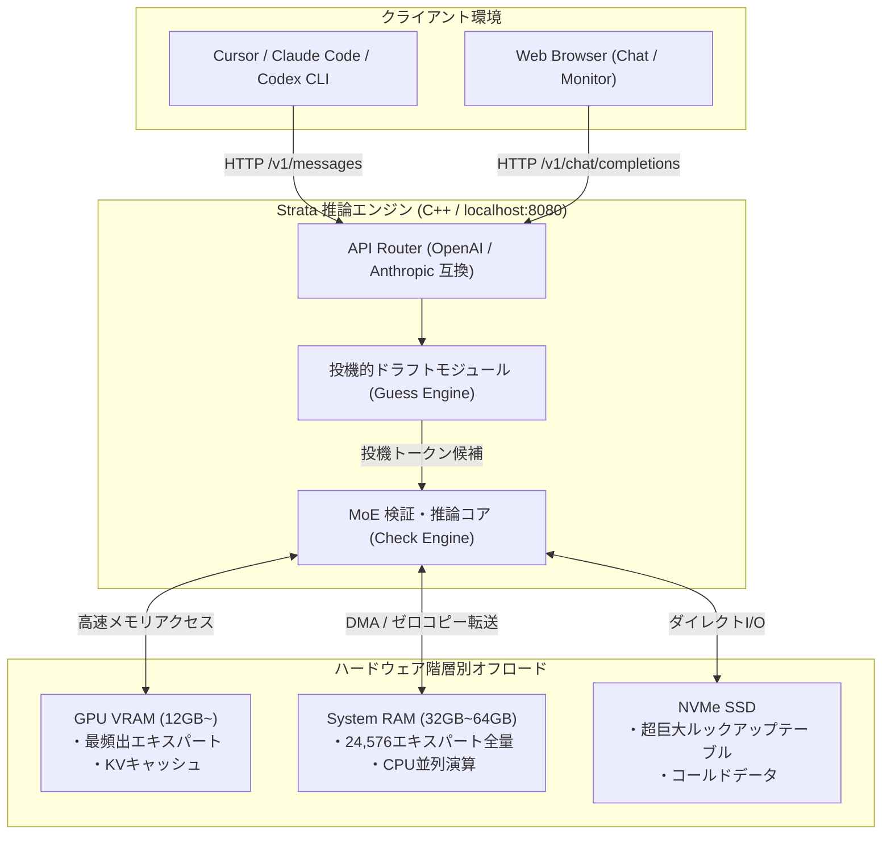

# Strata: 概要と革新性

**Strata** は、1250億パラメータ規模の次世代オープンウェイトモデル「Qwen3.8-Flash-Next」を、一般的なコンシューマー向けゲーミングPC（VRAM 12GB〜）上で高速推論させるC++製オープンソース推論エンジンです。

従来のローカルLLM運用では、100Bを超える超巨大モデルを実行するために数十万円から数百万円規模のエンタープライズ向けGPU（NVIDIA A100/H100など）やマルチGPU環境が必須でした。Strataは独自の階層型メモリ管理アーキテクチャと投機的デコーディング（Speculative Decoding）を融合させることで、RTX 4070/5070やRadeon RX 7800 XTといった市販の12GB GPU環境で、毎秒50〜90トークン以上の実用的な生成速度を実現しています。

さらに、`localhost:8080`上でOpenAI API互換（`/v1/chat/completions`、`/v1/responses`）およびAnthropic API互換（`/v1/messages`）のエンドポイントを透過的に提供するため、Claude Code、Cursor、Codex CLIといった既存の開発エコシステムへ一切のコード改変なしで接続可能です。

---

## 解決する主要な課題とアーキテクチャ

超巨大モデル（100B+クラス）の推論における最大のボトルネックは「GPU VRAM容量の不足」と「メモリ帯域幅」です。StrataはMoE（Mixture of Experts）構造のスパース性を極限まで活用し、ハードウェア資源（VRAM・メインメモリ・NVMe SSD）を階層的に最適配置する設計を採用しています。

### 1. 24,576エキスパートの階層的オフロード（Pantry & Counterモデル）
モデル全体が内包する24,576のエキスパートのうち、各トークン生成で活性化するのはごく一部（約10エキスパート）です。Strataは頻出する「コア・エキスパート」のみを高速なGPU VRAM（Counter）に常駐させ、全エキスパート実体をシステムRAM（Pantry）に、巨大ルックアップテーブルをNVMe SSDに分散配置します。

### 2. 投機的推論（Speculative Guess & Check）
軽量なドラフトモデルが数トークン先を投機的に予測（Guess）し、巨大な本体モデルが一括検証（Check）を行うことで、推論速度を従来の1.6〜1.8倍に引き上げています。



---

## 競合ツール/商用SaaSとの徹底比較

| 評価項目 | OpenAI / Anthropic API (商用SaaS) | 一般的なローカルLLM (Ollama / vLLM) | Strata (Qwen3.8-Flash-Next) |
|---|---|---|---|
| **月額・従量課金コスト** | 高額（トークン従量課金、月数万〜数十万円） | インフラコストのみ | **完全無料（電気代のみ）** |
| **機密データ漏洩リスク** | クラウド送信による規約・漏洩懸念 | なし（オンプレミス） | **ゼロ（全処理がローカル完結）** |
| **100B+ MoE実行要件** | 不要（クラウド完結） | VRAM 80GB〜（A100クラス必須） | **コンシューマーGPU（12GB VRAM〜）で動作** |
| **生成速度 (12GB GPU時)** | 40〜80 tokens/s (回線依存) | 動作不可または < 5 tokens/s | **53〜94 tokens/s (爆速推論)** |
| **API互換性** | 独自規格（標準） | OpenAI互換のみが主流 | **OpenAI ＋ Anthropic 両互換** |
| **セットアップ工数** | APIキー発行のみ | Docker/CUDAビルド等の知識が必要 | **ワンクリック実行（.bat / .sh）** |

---

## 💡 ビジネス・マネタイズ活用アイデア（実践例）

1. **セキュアコーディング特化の社内開発基盤受託（受託単価：150万〜250万円）**
   - 金融・医療・製造業など、ソースコードのクラウド送信が厳禁されている企業向けに、Cursor / Claude Code完全対応のローカル推論端末をパッケージ構築。
   - 既存のPC資産（RTX 4070搭載ワークステーション等）を活用し、社内ネットワーク完結の開発環境を提供。

2. **自社特化型ローカルRAGマイクロSaaS / アプライアンス販売**
   - 32K〜128Kの大規模コンテキストを活用し、社内マニュアルや設計書を常時参照するオンプレミス型QAアプライアンス端末のOEM提供（初期導入50万円＋月額保守5万円）。

3. **ローカルマルチモーダル検査システム（エッジAI導入支援）**
   - 画像認識（Vision）機能を活かし、工場ラインや検品現場での欠陥検査AIをローカルPC上で完結構築。クラウド通信費とレイテンシを完全にゼロ化。

---

## インストール & クイックスタート手順

### 1. 動作要件
- **GPU**: NVIDIA RTX 20/30/40/50シリーズ（VRAM 12GB以上）または AMD RX 6800/7800/7900/9070シリーズ
- **RAM**: 32GB以上（64GB推奨）
- **ストレージ**: 空き容量80GB以上の高速SSD（NVMe推奨）
- **OS**: Windows 10/11 または Linux

### 2. ワンクリックセットアップ

#### Windowsの場合
```cmd
:: リポジトリのクローンまたはZIP解凍
git clone https://github.com/Niko1221/Strata.git
cd Strata

:: インストーラーの実行（モデル選択、環境チェックが対話形式で自動実行）
START-HERE.bat
```

#### Linuxの場合
```bash
git clone https://github.com/Niko1221/Strata.git
cd Strata
chmod +x setup.sh
./setup.sh
```

### 3. API経由での呼び出しテスト（Python例）
サーバー起動後、`http://127.0.0.1:8080`にてOpenAI互換APIが即座に利用可能です。

```python
from openai import OpenAI

client = OpenAI(
    base_url="http://127.0.0.1:8080/v1",
    api_key="not-needed" # 任意の文字列で可
)

response = client.chat.completions.create(
    model="qwen3.8-flash-next",
    messages=[
        {"role": "system", "content": "あなたは優秀なC++アーキテクトです。"},
        {"role": "user", "content": "投機的デコーディングの利点を端的に解説してください。"}
    ],
    temperature=0.7
)

print(response.choices[0].message.content)
```

---

## 商用利用可否 & ライセンス考察

- **エンジン本体（Strata）**: **MIT License** で提供されており、商用利用、改変、再配布、プライベート利用が完全に自由です。受託開発での納品物への組み込みや、自社商用パッケージとしての販売に法的な制約はほぼありません。
- **モデル（Qwen3.8-Flash-Next）**: Qwenのオープンウェイトライセンスに基づきます。商用利用は許諾されていますが、モデル固有の利用規約（倫理規定・大規模商業展開時の条項など）を事前に確認してください。
- **派生コンポーネント**: 一部に `llama.cpp` / `ggml` のコードベースを含んでいるため、該当モジュールを静的・動的リンクする際はクレジット表記要件に留意してください。